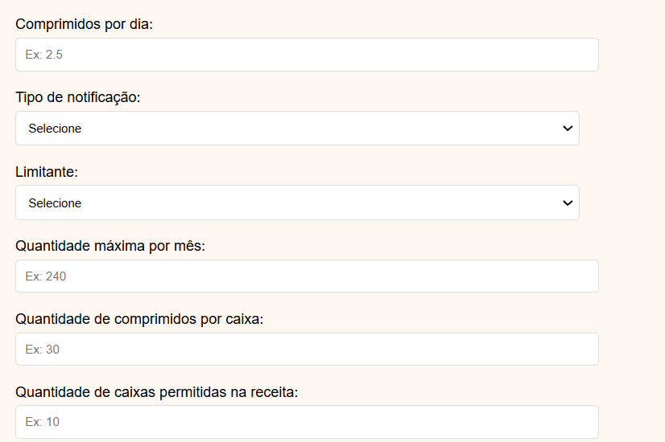
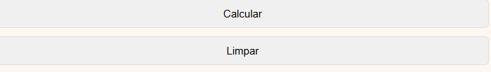
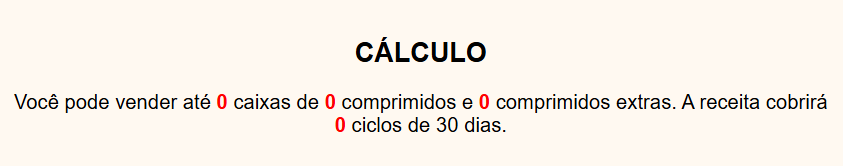

# Calculadora de Dispensação de Medicamentos

## Descrição
A **Calculadora de Dispensação de Medicamentos** é uma ferramenta desenvolvida para auxiliar profissionais de saúde e atendentes de drogarias na determinação da quantidade correta de medicamentos a serem dispensados, garantindo conformidade com as normativas vigentes da **Resolução da Diretoria Colegiada (RDC) da ANVISA**.

💡Essa ideia surgiu a partir de uma necessidade da drogaria digital Far.me, que precisou de uma solução para corrigir os erros de dispensação de medicamentos.


## Funcionalidades
- **Cálculo da dispensação** baseado na posologia prescrita e na quantidade máxima permitida conforme a **RDC**.
- **Interpretação automática das notificações A, A2 e B2**, limitando a dispensação a 30 dias.
- **Para demais categorias de medicamentos**, aplicação do limite de até 60 dias.
- **Modo de cálculo para medicamentos líquidos (gotas e frascos)** com base na dosagem prescrita.
- **Modo de cálculo para comprimidos e cápsulas**, considerando a quantidade máxima permitida.
- **Opção de cálculo quando o limitante for "caixas"**, desabilitando a quantidade máxima por mês e considerando o total de comprimidos disponíveis.
- **Interface intuitiva** para facilitar o uso por farmacêuticos e prescritores.

## Requisitos
- **Linguagem**: HTML, CSS e JavaScript
- **Plataforma**: Compatível com Windows, Linux e macOS

## Como Usar
1. Abra a calculadora no seu navegador:
   ```bash
    https://github.com/luanaagsilva/dispensacao_drogaria
   ```
2. Preencha os campos:
   ```
   Preencha todos os campos de acordo com a receita:
   ```
      

3. Calcular a quantidade exata para dispensação:
   ```
   Use o botão "calcular", para calcular a quantidade permitida para dispensação ou então use o botão "limpar" para limpar todos os campos.
   ```
    

4. Interpretando o resultado:
   ```
   Nesse campo vai apresentar a quantidade exata de medicamentos permitidos para a dispensação de acordo com a RDC vigente.
   ```
 
## Conformidade com a RDC
Esta calculadora foi desenvolvida para atender às diretrizes da **RDC vigente**, garantindo que os cálculos de dispensação estejam em conformidade com as regulamentações de prescrição e dispensação de medicamentos controlados.

## Contribuição
Contribuições são bem-vindas! Sinta-se à vontade para abrir uma issue ou enviar um pull request.


